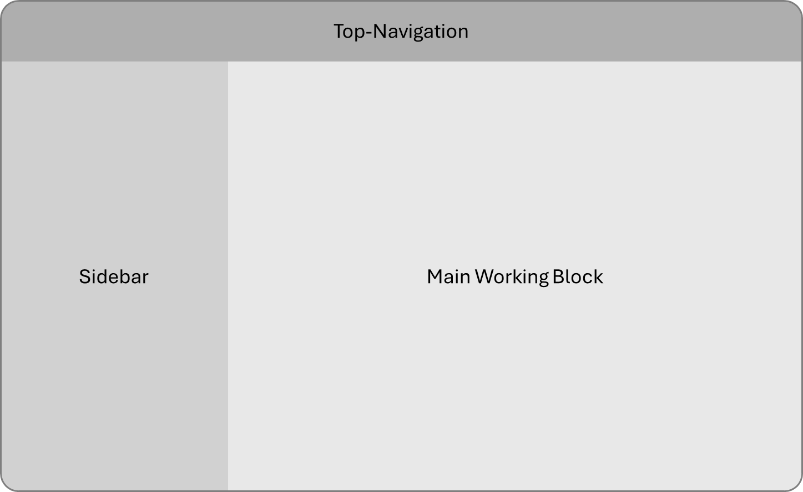

# Frontend: Next.js

## Original creation
This is a [Next.js](https://nextjs.org) project bootstrapped with [`create-next-app`](https://nextjs.org/docs/app/api-reference/cli/create-next-app).

Is started as part of the whole MedAgent project, see [here](../README.md#installation).

Further notes:
- To test ONLY frontend, can start with: `npm run dev` (requires having npm installed)
- Can start editing the page by modifying `app/page.tsx`. The page auto-updates as you edit the file.
- This project uses [`next/font`](https://nextjs.org/docs/app/building-your-application/optimizing/fonts) to automatically optimize and load [Geist](https://vercel.com/font), a new font family for Vercel.

Development of frontend:
- Basic documentation here: [Next.js Documentation](https://nextjs.org/docs) - learn about Next.js features and API.
- [Learn Next.js](https://nextjs.org/learn) - an interactive Next.js tutorial.
- You can check out [the Next.js GitHub repository](https://github.com/vercel/next.js) - your feedback and contributions are welcome!

Deployment as recommended from Next.js:
- Via [Vercel Platform](https://vercel.com/new?utm_medium=default-template&filter=next.js&utm_source=create-next-app&utm_campaign=create-next-app-readme) from the creators of Next.js
- Check out our [Next.js deployment documentation](https://nextjs.org/docs/app/building-your-application/deploying) for more details.

## MedAgent
Every page in our frontend will have same three basic blocks:

<!--suppress CheckImageSize -->
<center></center>

The Top-Navigation pan allows navigation between:
- Home menu (Providing overview over content)
- Different pages like "Chatbot", "Knowledge", "Workflow Design", ...
- This pan varies based on the user (not all users have access to all pages)

The Sidebar pan can be toggled (show / do not show) and contains different content based on the current page. But it overall provides sub-navigation for the main working block.
- Example for Chatbot Page: Select which workflow to use for the concrete interaction.

Finally, the Main Working Block captures the main interaction, depending on the current page and selected sub-navigation.
- Example for Chatbot Page: The actual interaction with some Chatbot (can input text, and get out answers)

### Structure of project
```
📁 frontend/
├── 📁 public/            # Static assets (images, fonts, icons)
├── 📁 src/               
│   └── 📁 app/           # App Router (Next.js 13+)
│       ├── layout.tsx     # Root layout
│       ├── page.tsx       # Main page
│       ├── 📁 pages/         # The main pages
│       ├── 📁 components/    # Reusable UI components
│       ├── 📁 store/         # State management (Redux/Zustand)
│       ├── 📁 styles/        # Global and modular CSS/SCSS
│       └── 📁 utils/         # General utilities
│
├── ...
└── README.md
```

